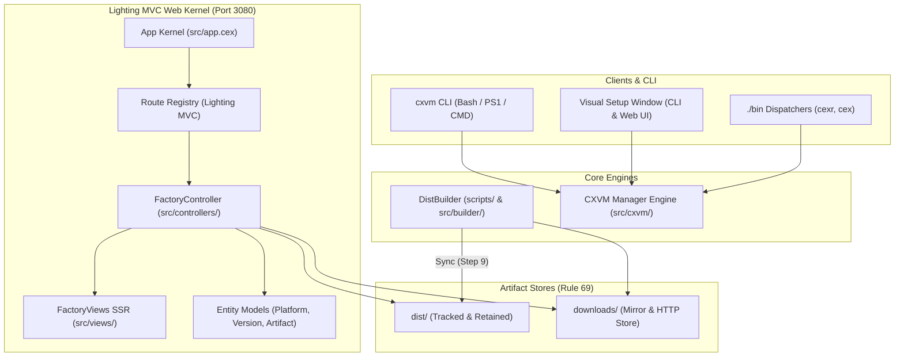

# Architecture & Design Standard: CXVM & Lighting MVC

<!-- Standard Specification: .agents/standards/ARCHITECTURE.md -->
<!-- Rule Conformance: Rule 69 (Target), Rule 29 (EOF), Rule 72 (Dynamic Paths) -->

## 1. System Architecture

`cxvm` (`@2tek/cxvm`) is structured into four primary subsystems:

---

## 2. Core Subsystems

### 2.1 Lighting Fullstack MVC Kernel
- **`src/app.cex`**: Bootstraps the Lighting MVC application, registers HTTP routes, and mounts the static asset handler. Prioritizes `dist/` before falling back to `downloads/`.
- **`src/controllers/factory_controller.cex`**: Handles HTTP requests for catalog views, setup window rendering, download streaming, and REST API responses (`/api/v1/*`).
- **`src/views/factory_views.cex`**: Server-side rendered HTML views featuring responsive layouts, dark theme styling, setup window UI with desktop window chrome (`🔴 🟡 🟢`), and platform selection tabs.
- **`src/models/`**: Strongly-typed model definitions for `Platform`, `Version`, and `Artifact` with schema validation and architecture metadata.

### 2.2 Distribution Engine (`DistBuilder`)
- **36 Platform Bundles**: 6 versions (`v8.0.0`, `v7.2.0`, `v6.0.0`, `v5.1.0`, `v2.0.0`, `v1.0.0`) × 6 platform targets.
- **Checksum & Manifest Verification**: Generates `SHA256SUMS` and `manifest.json`.
- **Dual Store Synchronization**: Builds directly into `downloads/` and synchronizes to `dist/` (Rule 69).

### 2.3 CXVM Version Manager Engine
- **Directory Layout**:
  - `~/.cxvm/versions/v<version>`: Extracted binary runtimes.
  - `~/.cxvm/current`: Active version symlink.
  - `~/.cxvm/downloads`: Local bundle archive cache.
- **Shell Profile Integration**: Appends dynamic initialization block exporting `CXVM_DIR`, `CEX_HOME`, and prepending `$CXVM_DIR/current/bin` to `PATH`.

---

## 3. Storage & Packaging Invariants (Rule 69)

1. **`dist/` Retention**: In CexR v8 of `.cex_boxes`; when loaded, dependencies load from the dist file of `.cex_boxes/{dependencyName}` to runtime, with `cex-pack.json`. If target is runtime, **do not use `.gitignore` for dist bundle file**.
2. **Dual Availability**: All 36 cross-platform distribution archives reside in both `dist/` and `downloads/`.
3. **No External C++**: The entire codebase in v2 is pure Cex, executed by `cexr` and compiled by `cexp`.
